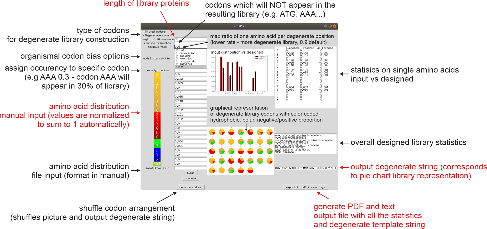

# CoLiDe: Combinatorial Library Design tool for probing protein sequence space


<p align="center">

</p>


This code repository includes the tool from the paper [Paper](https://doi.org/10.1093/bioinformatics/btaa804):

```
CoLiDe: Combinatorial Library Design tool for probing protein sequence space
Tretyachenko V, Voráček V, Souček R, Fujishima K, and Hlouchová K.
Bioinformatics 2020 
```
The source code is released under the MIT License. See the License file for details. 


# Usage

on the first use download and install miniconda 3.x from https://docs.conda.io/en/latest/miniconda.html
1) open Anaconda prompt and run the command inside quotation marks "cd xxx", where xxx is the path to the directory with  CoLiDe
on first use run command inside quotation marks "conda install --file requirements.txt"
2) run the command inside quotation marks "python gui.py"


# Documentation

A short version of a documentation follows. For the full documentation, follow [this link](colidemanual.pdf)



# Contact
The software was developed in the Klara Hlouchova Research Group, see http://khlab.org/.

For any question, you can contact voracva1@fel.cvut.cz


# Citation
If you use this codebase or any part of it for a publication, please cite:
```
@article{CoLiDe2020,
    author = {Tretyachenko, Vyacheslav and Voráček, Václav and Souček, Radko and Fujishima, Kosuke and Hlouchová, Klára},
    title = "{CoLiDe: Combinatorial Library Design tool for probing protein sequence space}",
    journal = {Bioinformatics},
    year = {2020},
    doi = {10.1093/bioinformatics/btaa804},
}
```


